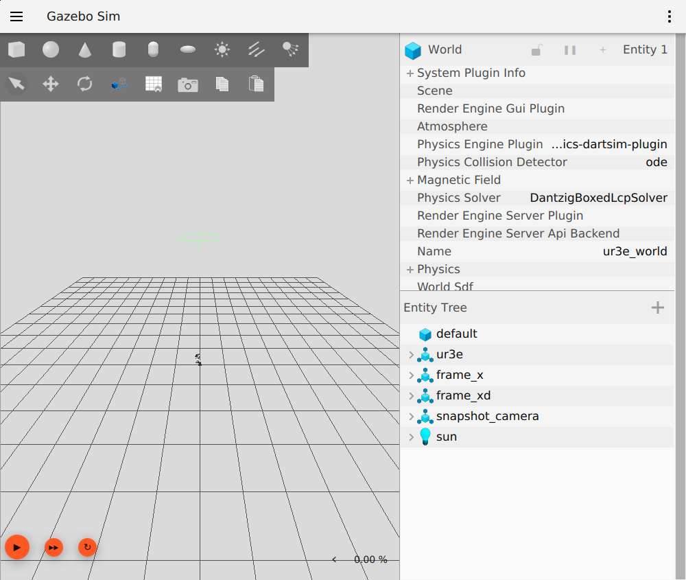
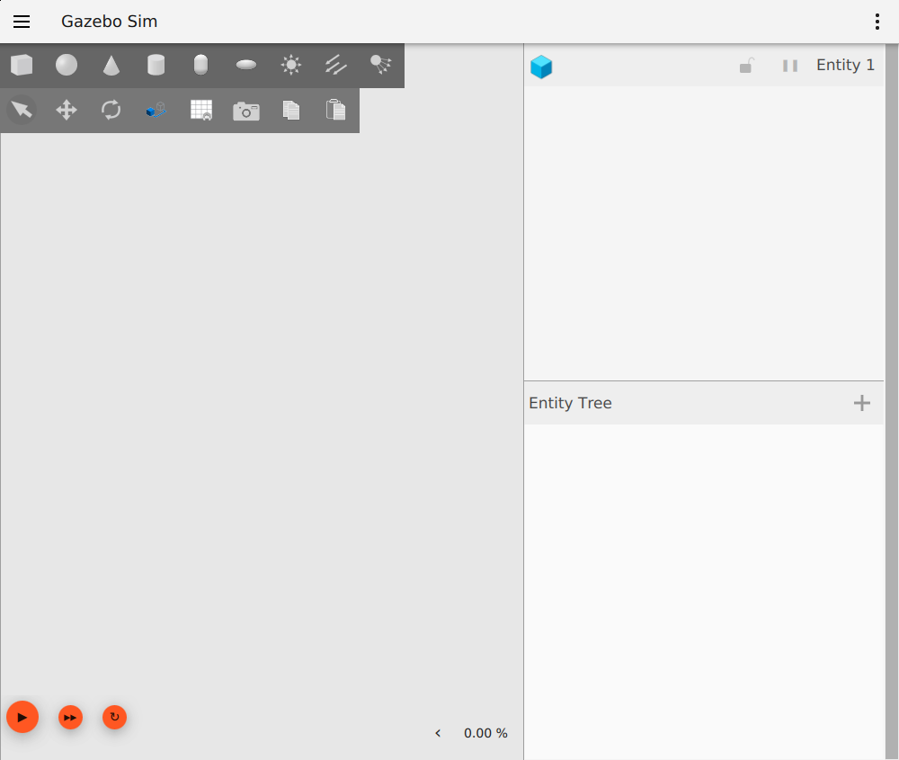
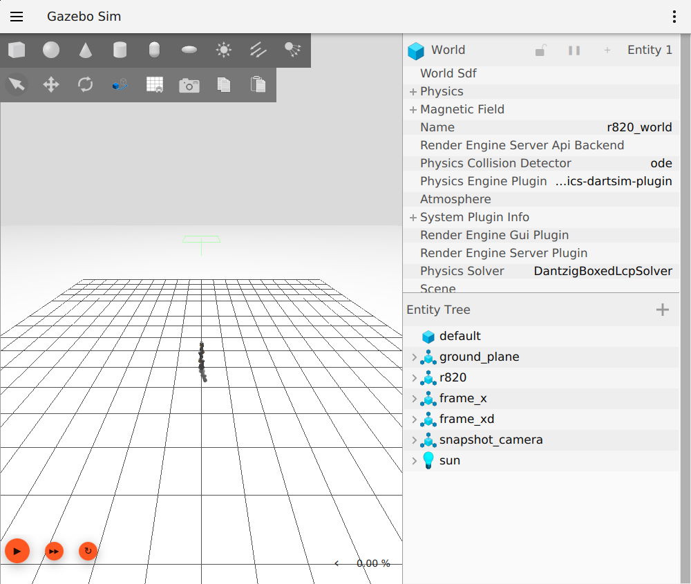

# sas_robot_driver_gazebo

> [!TIP]
> Repository for this module: https://github.com/MarinhoLab/sas_robot_driver_gazebo <br/>
> More information about SmartArmStack is available in https://smartarmstack.github.io/.

## Worlds

Each `sdf/*_world.sdf` file is a ready-made Gazebo world. Run
`setup_vendor.sh ur` first to download the mesh models, then launch a world
with `gz sim <world>.sdf`.

| World file         | Robot                       | DOF |
|--------------------|-----------------------------|-----|
| `sdf/ur3e_world.sdf` | Universal Robots UR3e     | 6   |
| `sdf/ur30_world.sdf` | Universal Robots UR30     | 6   |
| `sdf/r820_world.sdf` | KUKA r820 (iiwa-style)    | 7   |

### `ur3e_world`



### `ur30_world`



### `r820_world`



## Licenses

Check any licenses in repositories in `vendor` if you decide to use them. This repository's owner holds no
liability for misuse. 

## Folder structure

The folders below have special meanings, the others follow usual naming.

| Folder    | Meaning                                                                                                    |
|-----------|------------------------------------------------------------------------------------------------------------|
| `sdf`     | Base Gazebo scene files.                                                                                   |
| `vendor`  | Vendor models. Check the licenses if you decide to use them in your work. They are not shared in this repo |
| `convert` | Vendor-model to Gazebo-SDF conversion scripts. See `convert/README.md` for usage.                          |

## Vendor Setup

Vendor robot models are not shared in this repository. `scripts/setup_vendor.sh`
clones them into `~/.sas/sas_robot_driver_gazebo/vendor`, skipping any that are
already present:

```console
# Clone a single vendor's models
./scripts/setup_vendor.sh ur

# Clone all supported vendors (ur, unitree, bota, agilex)
./scripts/setup_vendor.sh all
```

## ROS 2 Nodes & Parameters

Each node loads its parameters from a YAML configuration file. The default is
`config/config.yaml` in this package; pass a different file with the
`config_file:=` launch argument of the corresponding launch file.

### Node: `sas_robot_driver_ros_gazebo`

| Property | Value |
|---|---|
| **Executable** | `sas_robot_driver_ros_gazebo_node` (C++, default of `robot_driver_server_launch.py`), or `sas_robot_driver_ros_gazebo.py` (`implementation:=python`) |
| **ROS node name** | `ur3e_1` (set by the `name` launch argument of `robot_driver_server_launch.py`) |
| **Description** | Bridges ROS and Gazebo. Subscribes to Gazebo joint states and publishes target joint positions, running the `RobotDriverROS` control loop. |

#### Parameters

| Parameter | Type | Mandatory / Optional | Default | Purpose |
|---|---|---|---|---|
| `joint_names` | array of strings | **Mandatory** | none — must be provided | Names of the Gazebo joints to control |
| `joint_positions_topic_prefix` | string | **Mandatory** | none — must be provided | Gazebo topic prefix for target joint positions |
| `joint_states_topic` | string | **Mandatory** | none — must be provided | Gazebo topic of the joint states to read |
| `robot_name` | string | **Mandatory** | none — must be provided | Name of the robot; used as the robot-driver topic prefix |
| `thread_sampling_time_sec` | double | Optional | `0.002` | Sampling period of the control-loop thread (see [Bridge loop period](#bridge-loop-period)) |

### Node: `sas_object_server_gazebo_node`

| Property | Value |
|---|---|
| **Executable** | `sas_object_server_gazebo_node` |
| **ROS node name** | `sas_object_server_gazebo_node` |
| **Description** | Synchronizes the poses of the configured world entities with ROS: sends poses to the Gazebo `set_pose` service and publishes them on the `get_pose` topic. |

#### Parameters

| Parameter | Type | Mandatory / Optional | Default | Purpose |
|---|---|---|---|---|
| `set_pose_service_name` | string | **Mandatory** | none — must be provided | Gazebo `set_pose` service name |
| `get_pose_topic_name` | string | **Mandatory** | none — must be provided | Gazebo absolute-pose info topic name |
| `entity_names` | array of strings | **Mandatory** | none — must be provided | World entities whose poses are synchronized |
| `thread_sampling_time_sec` | double | Optional | `0.01` | Sampling period of the synchronization loop |

### Node: `sas_simulator_server_gazebo_node`

| Property | Value |
|---|---|
| **Executable** | `sas_simulator_server_gazebo_node` |
| **ROS node name** | `sas_simulator_server_gazebo_node` |
| **Description** | Binds Gazebo world control services (start/stop/step simulation) to ROS. |

#### Parameters

| Parameter | Type | Mandatory / Optional | Default | Purpose |
|---|---|---|---|---|
| `service_name` | string | **Mandatory** | none — must be provided | Gazebo world control service name (e.g. `/world/<world>/control`) |
| `thread_sampling_time_sec` | double | Optional | `0.01` | Sampling period of the control loop |
| `autostart` | bool | Optional | `true` | Start the simulation on node startup |

**How mandatory/optional is determined in code:**
- **Mandatory** params are read with `sas::get_ros_parameter(...)` — if missing, the node throws and fails to start.
- **Optional** params are read with `sas::get_ros_optional_parameter(..., <default>)` — they carry in-code defaults.

**Launch arguments** (`simulator_server_launch.py`): `name` and `config_file`. The simulation is autostarted by default (`autostart: true` in the configuration file and in the node's in-code default); to disable it, pass a configuration file that sets `autostart: false` (e.g. `ros2 launch sas_robot_driver_gazebo simulator_server_launch.py config_file:=/path/to/no_autostart.yaml`).

#### Sample launches

```console
ros2 launch sas_robot_driver_gazebo robot_driver_server_launch.py
ros2 launch sas_robot_driver_gazebo object_server_launch.py
ros2 launch sas_robot_driver_gazebo simulator_server_launch.py
```

## SDF Serial-Manipulator Loader

```console
# Print the kinematics of a serial-manipulator SDF model as YAML.
sdf2manipulator sdf/r820.sdf

# Also print the per-joint limits.
sdf2manipulator sdf/r820.sdf --joint-limits

# Load the kinematic model from a world file (auto-detected).
sdf2manipulator sdf/ur3e_world.sdf

# Select a specific (possibly nested) model by its "::"-separated scope.
sdf2manipulator sdf/ur3e_world.sdf --model-scope "ur3e::ur3e_position_controller::ur3e"
```

`r820.sdf` (7 revolute joints) and `ur30.sdf` / `ur3e.sdf` (6 revolute joints
each) are ready-made model-file test inputs, and `r820_world.sdf` /
`ur3e_world.sdf` are ready-made world-file inputs that nest the same robots
behind `<include>` chains; all have every joint acting about +z.

## The C++ driver

`RobotDriverGazebo` is implemented in C++
(`include/sas_robot_driver_gazebo/sas_robot_driver_gazebo.hpp`). The bridge
node `sas_robot_driver_ros_gazebo_node` uses it directly; Python scripts use
it through its pybind11 binding, re-exported by the package:

```python
from marinholab.sas.core import ShutdownSignaler
from sas_robot_driver_gazebo import RobotDriverGazebo, RobotDriverGazeboConfiguration
```

`RobotDriverGazebo` is a `marinholab.sas.core.RobotDriver` that
`sas_robot_driver.RobotDriverROS` accepts, with the constructor, methods and
`configuration` attribute of the former pure-Python driver, which it
replaces; its getters return NumPy arrays. The binding is built with the
pybind11 that sas_robot_driver and marinholab-sas-core use (the `pybind11`
submodule, branch v3.0, at sas_robot_driver's commit; run
`git submodule update --init`) and `py::smart_holder`, as they bind
`RobotDriver`.

The pure-Python driver reported joint positions seconds behind Gazebo's, or
not at all: `sas_robot_driver.RobotDriverROS.control_loop()` holds the Python
interpreter lock while its C++ loop sleeps, so the gz-transport thread
running its Python joint-state callback rarely ran. The C++ driver's callback
takes no interpreter lock; with it, the bridge reports Gazebo's joints with no
measurable lag at 2 ms and 1 ms. The measurements, the profile and how to
reproduce them are in [BENCHMARK.md](BENCHMARK.md).

## Considerations

### Bridge loop period

The bridge runs its `RobotDriverROS` loop every `thread_sampling_time_sec`,
0.002 s (500 Hz) by default, as the C++ driver keeps up at that rate and at
0.001 s. With the former pure-Python driver it did not: its reported joint
positions fell seconds behind Gazebo's, because
`sas_robot_driver.RobotDriverROS.control_loop()` holds the Python interpreter
lock while its C++ loop sleeps, and #20 set 0.01 s as a mitigation. See
[The C++ driver](#the-c-driver) and [BENCHMARK.md](BENCHMARK.md).

- `gz::sim::systems::PosePublisher` has been considered to read poses of entities. However, it's more convenient for `tf2` given how the frames are described. 
- The translation tool inside Gazebo can be used to move objects and reading their pose works only after the motion is finished. The intermediate state is not reflected in the `pose` topic.
